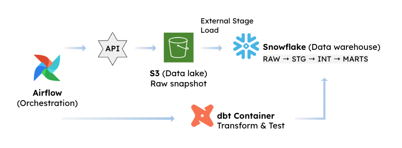
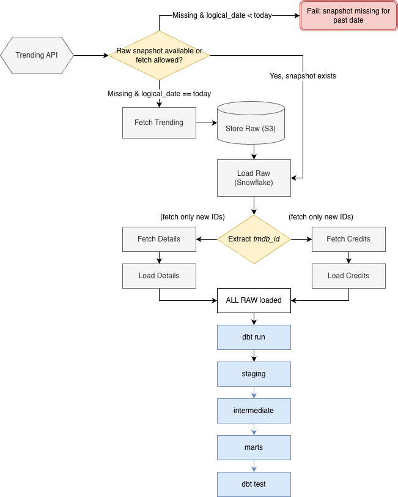
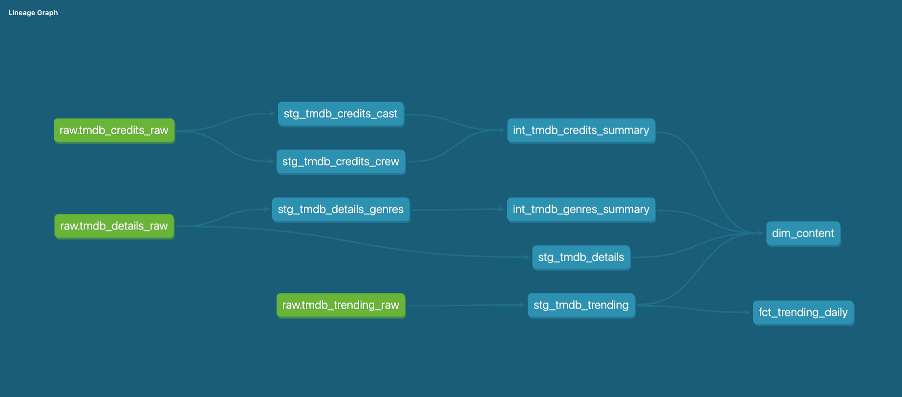

# TMDB Trending Data Pipeline

This project builds a reproducible data pipeline that ingests trending content from the TMDB API, stores immutable raw snapshots in S3, and transforms them into analytical datasets in Snowflake using dbt.

Because the TMDB API does not provide historical snapshots for past dates, the pipeline uses S3 as the source of truth to ensure reproducibility.

It also supports **multi-source enrichment** by incrementally fetching additional datasets (details, credits) while minimizing unnecessary API calls.

The design emphasizes reproducibility, idempotent ingestion, and clear separation between orchestration and transformation.


## Architecture


The pipeline is composed of three main components: **Airflow for orchestration**, **S3 for raw data storage**, and **Snowflake for analytical processing**, with **dbt handling transformations** within the warehouse.

Airflow runs as **a stateful orchestrator**, managing scheduling, execution state, retries, and dependency resolution across the pipeline. It coordinates ingestion, replay logic, raw data loading, and triggers downstream transformation jobs.


dbt is executed in **a separate, stateless container** and is invoked only when transformations are required. This keeps transformation logic isolated from orchestration concerns and avoids coupling dbt dependencies to the Airflow runtime.

S3 stores immutable raw snapshots and serves as the source of truth for replay, while Snowflake acts as the analytical warehouse where data is transformed via dbt.

This architecture enforces clear separation of concerns between orchestration, transformation, and storage, ensuring reproducibility, operational simplicity, and independent evolution of each component.


## Data Flow


The pipeline is orchestrated by Airflow and starts by checking whether a raw snapshot for the current `logical_date` already exists in S3.

This replay step is required because the **TMDB trending API does not provide historical snapshots for past dates.**

The flow therefore follows three possible paths:

- If a raw snapshot already exists in S3, the pipeline reuses that snapshot and loads it into Snowflake.
- If no snapshot exists and the `logical_date` is today, the pipeline fetches fresh trending data from the TMDB API, stores the raw payload in S3, and then loads it into Snowflake.
- If no snapshot exists and the `logical_date` is in the past, the pipeline fails. Reproduction is only possible when a raw snapshot already exists in S3, which is treated as the source of truth.

After the trending data is loaded, the pipeline extracts `tmdb_id` values and performs enrichment by fetching additional datasets such as details and credits.

Only IDs not already present in S3 are fetched, ensuring incremental enrichment while minimizing API usage.

Finally, dbt transforms the raw data in Snowflake into structured analytical models across the staging, intermediate, and mart layers, and applies tests to validate model integrity.


## Data Modeling & Transformation


Transformations are implemented using dbt within Snowflake, following a layered modeling approach: **staging → intermediate → marts**.

dbt transformations are triggered by Airflow only after all required raw datasets have been successfully loaded into Snowflake. This ensures that transformations always run on a complete and consistent set of inputs.

### Staging Layer

The staging layer standardizes raw data loaded from Snowflake RAW tables.

- Flattens semi-structured JSON fields from TMDB API responses
- Renames and casts columns into consistent formats
- Applies basic data quality checks (e.g., not null, accepted values)

Each source dataset (trending, details, credits) is transformed into its own staging model.

### Intermediate Layer

The intermediate layer performs enrichment and data restructuring.

- Trending data provides a list of `tmdb_id`
- Additional datasets (details, credits) are joined and aggregated
- Data is reshaped into analysis-ready structures

This layer bridges raw ingestion and final analytical models.

### Mart Layer

The mart layer defines business-facing models using dimensional modeling principles.

- **dim_content**  
  Consolidates core attributes of movies and TV shows

- **fct_trending_daily**  
  Captures daily trending metrics such as popularity and vote counts

These models are designed for analytical queries and reporting.


### Data Quality

dbt tests are applied to ensure data integrity:

- `not_null` constraints on key fields (e.g., tmdb_id)
- Uniqueness checks on business keys
- Basic integrity checks enforced through model relationships

Tests are defined alongside models and executed as part of the dbt run.


## Key Design Decisions

- **Replay Strategy**  
  S3 is used as the source of truth for raw snapshots because the TMDB API does not support reliable historical retrieval. Past runs can only be reproduced from stored snapshots in S3.

- **Selective Enrichment**  
  Additional datasets (details, credits) are fetched only for `tmdb_id` values not already present in S3, minimizing API usage and avoiding redundant ingestion.

- **Separation of Orchestration and Transformation**  
  Airflow and dbt are executed in separate containers to isolate orchestration logic from transformation logic, enabling independent development and execution.

- **Fail-Fast Reproducibility Guarantee**  
  The pipeline fails when historical snapshots are missing, prioritizing correctness over silent data inconsistency.

- **Trade-off: Storage vs Reproducibility**  
  Storing raw snapshots in S3 ensures reproducibility but increases storage requirements and requires lifecycle management.


## Project Structure

```text
.
├── dags/                           # Airflow DAG definitions (workflow orchestration)
│   ├── tmdb_ingestion_dag.py
│   └── tmdb_transformation_dag.py
│
├── src/                            # Core application logic 
│   ├── connector/                  # External system connectors (S3, Snowflake)                  
│   │   ├── s3.py
│   │   └── snowflake.py
│   │
│   ├── ingestion/              
│   │   ├── load/
│   │   │   └── snowflake_raw.py    # Handles S3 → Snowflake RAW loading
│   │   ├── sql/                    # SQL templates for COPY INTO / ingestion
│   │   │   ├── load_tmdb_trending.py
│   │   │   ├── load_tmdb_details.py
│   │   │   └── load_tmdb_credits.py
│   │   └── tmdb/                   # TMDB API clients
│   │       ├── client.py
│   │       ├── credits.py
│   │       ├── details.py
│   │       └── trending.py
│   └── tmdb_orchestration.py      # Coordinates ingestion workflows
│
├── dbt/                           # dbt project (transformation layer)
│   └── tmdb_dbt/
│       ├── models/
│       │   ├── staging/
│       │   │   ├── stg_tmdb_trending.sql
│       │   │   ├── stg_tmdb_details.sql
│       │   │   ├── stg_tmdb_details_genres.sql
│       │   │   ├── stg_tmdb_credits_cast.sql
│       │   │   └── stg_tmdb_credits_crew.sql
│       │   ├── intermediate/
│       │   │   ├── int_tmdb_credits_summary.sql
│       │   │   └── int_tmdb_genres_summary.sql
│       │   └── marts/
│       │       ├── dim_content.sql
│       │       └── fct_trending_daily.sql
│       ├── dbt_project.yml
│       └── profiles.yml
│
├── tests/                          # Local smoke / validation tests
│
├── docker-compose.yml              # Multi-container setup (Airflow, dbt, etc.)
├── Dockerfile.airflow              # Airflow container image
├── Dockerfile.dbt                  # dbt container image
├── requirements-airflow.txt
├── requirements-dbt.txt
├── .env                            # Environment variables (not committed)
└── README.md

```
The project is structured to clearly separate orchestration, ingestion, and transformation responsibilities.

- **Airflow (`dags/`)** defines and schedules workflows, acting as the orchestration layer.
- **Core logic (`src/`)** contains modular ingestion components, including API clients, data loaders, and system connectors.
- **dbt (`dbt/`)** is fully isolated and handles all transformation logic inside Snowflake, including staging, intermediate models, and data marts.
- **Docker** is used to containerize Airflow and dbt separately, ensuring environment consistency and clear separation of concerns.

This structure allows each layer of the pipeline to be developed, tested, and operated independently.


## Getting Started
To run the pipeline locally:

```bash
git clone https://github.com/kngsoomin/tmdb-trending-data-pipeline
cd tmdb-trending-data-pipeline


# set environment variables
cp .env.example .env

# start services
docker compose up -d
```
Airflow UI is available at http://localhost:8081.

dbt transformations can be triggered via Airflow or executed manually:
```bash
# find dbt container name (e.g. *dbt*)
docker ps | grep dbt

# run dbt inside the container
docker exec -it <dbt-container-name> dbt run
docker exec -it <dbt-container-name> dbt test
```

## Future Work

- Extend data quality framework with stronger validation (e.g., schema enforcement and completeness checks)  
- Add monitoring and alerting for ingestion and transformation failures  
- Expand enrichment pipeline with additional third-party data sources  
- Introduce downstream consumers (e.g., BI dashboards or analytics applications)


