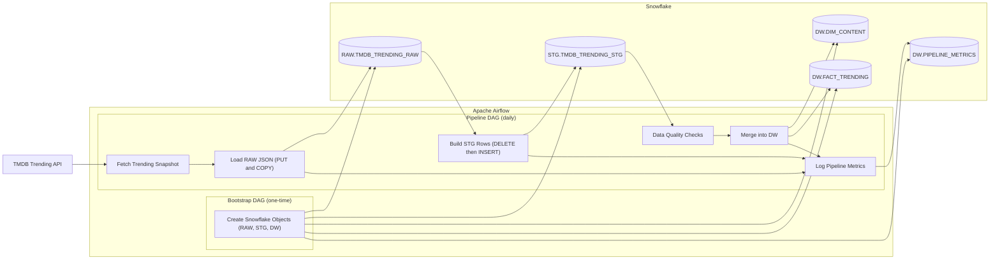

# 🎥 TMDB Trending Data Pipeline (Snowflake + Airflow + dbt)

**Tech Stack:** Python · Apache Airflow · Snowflake · Docker · TMDB API

## Project Phases

| Phase   | Description                                                          | Data Sources                             | Processing                                 | Key Focus                                                             |
| ------- | -------------------------------------------------------------------- | ---------------------------------------- | ------------------------------------------ | --------------------------------------------------------------------- |
| Phase 1 | Batch ETL pipeline for ingesting and transforming TMDB trending data | TMDB Trending API                        | Airflow + SQL                              | Pipeline orchestration, idempotent loads, medallion-style layering    |
| Phase 2 | Multi-source analytics platform with modular data modeling using dbt | TMDB (Trending, Details, Credits) + IMDb | Airflow (ingestion) + dbt (transformation) | Analytics engineering, dimensional modeling, data contracts & testing |

## Overview

This project demonstrates the design and implementation of a production-style data pipeline that ingests daily trending movies and TV shows from the TMDB API and delivers analytics-ready tables in Snowflake.

The focus is on reliability under real-world constraints (API limitations),
layered transformations, and idempotent delivery.

The resulting dataset captures daily popularity snapshots of content
and supports trend and time-series analysis.

## Design Focus

This pipeline was built with real-world production considerations in mind:

- Incremental ingestion under external API constraints
- Idempotent transformations and upserts
- Clear separation of RAW, STG, and DW layers
- Built-in data quality checks and operational metrics for better observability

## Architecture



The pipeline is orchestrated by Airflow and follows a layered **RAW → STG → DW** design in Snowflake, with built-in data quality checks and operational metrics to ensure correctness and observability.

> Airflow DAG with layered TaskGroups (RAW → STG → DW) and metric logging tasks

## Data Flow

### 1. Ingestion (RAW)

- Fetches the current TMDB trending snapshot
- Stores the raw JSON payload without transformation
- Loads data into Snowflake using PUT and COPY INTO

### 2. Transformation (STG)

- Flattens nested JSON arrays
- Extracts and type-casts structured fields
- Applies basic normalization
- Enforces data quality constraints

### 3. Analytics (DW)

- Upserts content metadata into a dimension table
- Maintains historical popularity metrics in a fact table

## Data Model

### Raw Layer

Stores the original API response as semi-structured JSON.

- Minimal processing with no business logic applied
- Schema-on-read design
- Replace-on-rerun semantics for the same date

### STG Layer

Represents a cleaned, flattened view of the raw payload.

- One row per `(trending_date, content, time_window)`
- Handles schema normalization and validation
- Designed to be fully reproducible for a given date

### DW Layer

- `DIM_CONTENT` stores stable metadata for movies and TV shows
- `FACT_TRENDING` stores daily popularity metrics for analytics and trend analysis

## Orchestration & Reliability

- Tasks are grouped by data layer (RAW / STG / DW)
- Each task performs a single, clearly scoped responsibility
- Failures prevent downstream execution to protect data correctness

### Operational Metrics

Each layer logs row counts and execution metadata into a metrics table, allowing:

- Detection of empty or partial loads
- Monitoring of volume changes over time
- Easier debugging during pipeline failures

## Backfill & Idempotency

### API Backfill Constraint

TMDB Trending API exposes **only the current popularity snapshot** and does not support historical queries.

#### Design decision

- API ingestion is **explicitly skipped** for historical logical dates
- This prevents writing incorrect or misleading historical data

#### Implication

- True API-level backfills are not possible
- Historical reprocessing is limited to data already captured in the RAW layer

### Controlled Backfills

While the API cannot be backfilled, the pipeline still supports safe downstream reprocessing:

- STG and DW layers can be re-built from existing RAW snapshots
- Backfills are supported for RAW → STG → DW
- Because raw API responses are preserved as immutable snapshots, downstream STG and DW layers can be safely reprocessed.
  This allows schema evolution, transformation logic fixes, and data quality improvements to be applied retroactively without re-calling the external API.

### Idempotent Data Delivery

To ensure safe re-runs and operational stability:

- Data is partitioned by logical date
- Transformations are deterministic
- DW tables use `MERGE`-based upserts

As a result, re-running the pipeline for the same date does not create duplicates and produces consistent results.

## How to Run

### Prerequisites

- Docker & Docker Compose
- Snowflake account
- TMDB API key

### Set up

#### Environment Variables

Runtime configuration is managed via a `.env` file.
Create a `.env` file in the project root with the following variables:

```env
AIRFLOW_UID=
AIRFLOW_PROJ_DIR=.
_AIRFLOW_WWW_USER_USERNAME=
_AIRFLOW_WWW_USER_PASSWORD=
TMDB_API_KEY=
TMDB_READ_ACCESS_TOKEN=
```

- `TMDB_API_KEY` is required for fetching trending data from the TMDB API.
- Airflow-related variables are used only for local development.

#### Snowflake Connection

- Snowflake credentials are managed via an Airflow Connection
  (`conn_id = snowflake_conn`) and are not stored in code or environment variables.

### Start Local Airflow Environment

```bash
make up
```

### Initialize Database Objects

Open http://localhost:8081 and run once:

```bash
tmdb_trending_bootstrap
```

### Run the Pipeline

Enable and trigger:

```bash
tmdb_trending_pipeline
```

## Testing

Unit tests focus on deterministic and isolated behavior of the pipeline logic.

- External API calls are mocked to avoid external dependencies
- No Airflow scheduler or Snowflake connection is required

This ensures fast, repeatable tests while keeping external systems outside the unit test boundary.

Run tests locally:

```bash
make test
```

# tmdb-trending-data-pipeline
